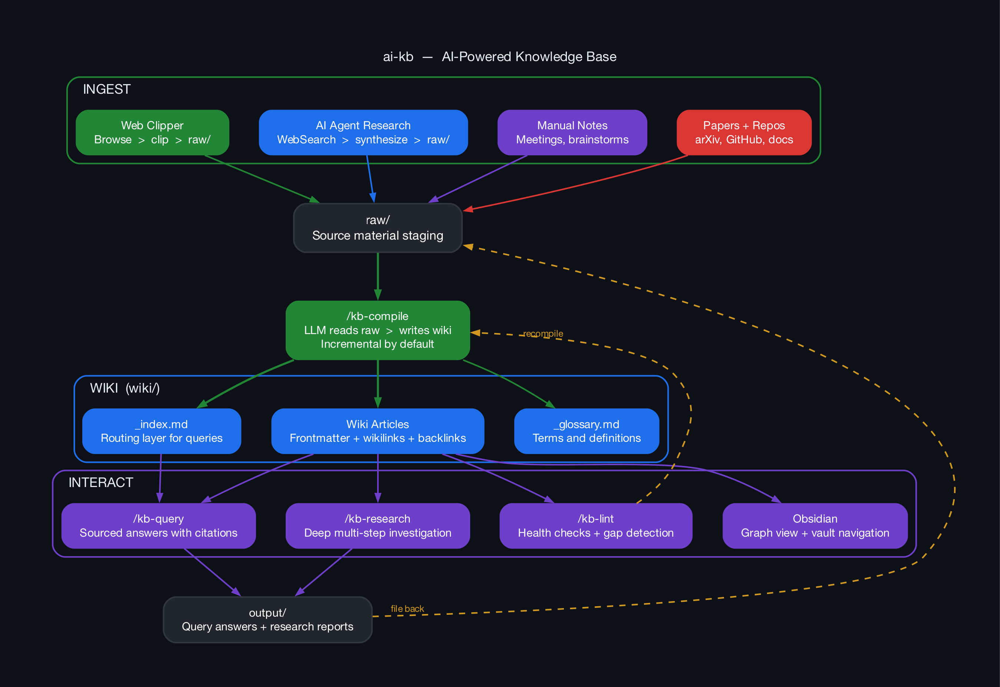

# ai-kb

An LLM-powered knowledge base that compiles raw source materials into a structured, interlinked markdown wiki. No vector databases, no RAG — just markdown as the source of truth.

Inspired by [Andrej Karpathy's LLM Knowledge Base workflow](https://venturebeat.com/data/karpathy-shares-llm-knowledge-base-architecture-that-bypasses-rag-with-an).




## Quick Start

```bash
# Clone the repo (or use as a template)
git clone https://github.com/ghndrx/ai-kb.git my-knowledge-base
cd my-knowledge-base

# Initialize
/kb-init "your topic here"

# Add source materials to raw/
# (markdown files — papers, articles, notes, repo docs)

# Compile into a wiki
/kb-compile

# Ask questions
/kb-query "How does X relate to Y?"

# Health check
/kb-lint

# Deep research
/kb-research "comprehensive analysis of Z"
```

## Commands

| Command | Description |
|---------|-------------|
| `/kb-init [topic]` | Scaffold directories and config |
| `/kb-compile [--full]` | Compile raw/ into wiki/ (incremental by default) |
| `/kb-query <question>` | Ask a question, get a sourced answer |
| `/kb-lint [--fix]` | Health check: broken links, orphans, stale content |
| `/kb-research <topic>` | Deep multi-step research with gap analysis |

## How It Works

```
raw/                          wiki/
├── paper-on-transformers.md    ├── _index.md (auto-generated)
├── blog-post-attention.md  →   ├── transformers.md
├── repo-readme-pytorch.md      ├── attention-mechanisms.md
└── notes-from-lecture.md       ├── pytorch-framework.md
                                └── training-optimization.md
```

1. **You** dump source materials (papers, articles, notes) into `raw/` as markdown files
2. **The AI** reads raw sources and compiles a structured wiki with:
   - YAML frontmatter (title, tags, sources, confidence)
   - `[[Wikilinks]]` connecting related concepts
   - Auto-generated index for navigation
3. **You** query the wiki — answers cite their sources with `(see [[Article]])`
4. **The AI** maintains the wiki with health checks: finds broken links, orphaned articles, stale content, and knowledge gaps

Every article traces back to its source files. No hallucination — gaps are marked explicitly with `[needs-source]`.

## Directory Structure

After running `/kb-init`:

```
your-kb/
├── raw/          ← Your source materials (add files here)
├── wiki/         ← Compiled knowledge base (AI-managed)
│   └── _index.md ← Auto-generated master index
├── output/       ← Query answers and research reports
├── kb.yaml       ← Configuration
├── scripts/      ← Helper scripts (stats, link checking, etc.)
└── CLAUDE.md     ← AI instructions (the "brain")
```

## Configuration

Edit `kb.yaml` to customize behavior:

```yaml
topic: "machine learning"
compile:
  mode: incremental     # or "full" for complete rebuild
  batch_limit: 30       # max articles per compile session
  auto_lint: true       # run link check after compile
query:
  max_sources: 8        # max wiki articles read per query
research:
  allow_web_search: false  # enable external search during research
```

## Obsidian Integration

The `wiki/` directory is a valid Obsidian vault out of the box:

1. Open Obsidian → "Open folder as vault" → select `wiki/`
2. `[[Wikilinks]]` resolve automatically
3. Graph View shows your knowledge network
4. Install **Dataview** plugin for dynamic queries on article frontmatter

## Tips

- **Web Clipper**: Use [Obsidian Web Clipper](https://obsidian.md/clipper) to save articles directly as markdown into `raw/`
- **Incremental builds**: Only changed files are recompiled by default — fast even with large KBs
- **File back results**: Move interesting `output/` files into `raw/` and recompile to grow the wiki
- **Subdirectories**: Organize `raw/` with subdirs (`raw/papers/`, `raw/articles/`) — the compiler handles it

## How It Compares

| Approach | Storage | Human-readable | Auto-maintained | Infrastructure |
|----------|---------|---------------|-----------------|---------------|
| **ai-kb** | Markdown files | Yes | Yes | None |
| RAG + Vector DB | Embeddings | No | No | Vector DB, embeddings pipeline |
| Traditional wiki | Markdown/HTML | Yes | No | Wiki software |

## Credits

- Concept by [Andrej Karpathy](https://karpathy.ai/)
- Built for use with any AI coding assistant

## License

MIT
